# PROGRAM ANALYSIS

## Program Analysis là gì ???

- Là việc tự động phân tích các hành vi của chương trình để:
  - Tìm ra lỗi khi lập trình
  - Tối ưu hóa hiệu năng
  - Tìm ra lỗ hổng bảo mật

## Static vs Dynamic Analysis

- Static analysis (phân tích tĩnh):

  - Phân tích source code, byte code hoặc binary code
  - Input và output:
    - Xem xét tất cả các inputs
    - Ước lượng dư các hành vi có thể xảy ra
  - Ví dụ: trình biên dịch, lint-like tool (công cụ hỗ trợ detect lỗi có thể phát sinh trong quá trình code), ...

- Dynamic analysis (phân tích động):

  - Phân tích lúc chương trình đang được thực thi
  - Input và output:
    - Chỉ xét input hiện tại
    - Ước lượng thiếu các hành vi có thể xảy ra
  - Ví dụ: auto testing, profiler (trình phân tích hiệu suất chương trình), ...

=> Static cho ra dư kết quả, Dynamic thì lại cho ra thiếu kết quả, dẫn đến việc phân tích một chương trình bằng 1 trong 2 phương pháp trên không thể hoàn thiện. Do đó việc sử dụng 1 trong 2 phương pháp trên là tùy thuộc vào điều kiện phân tích của từng chương trình

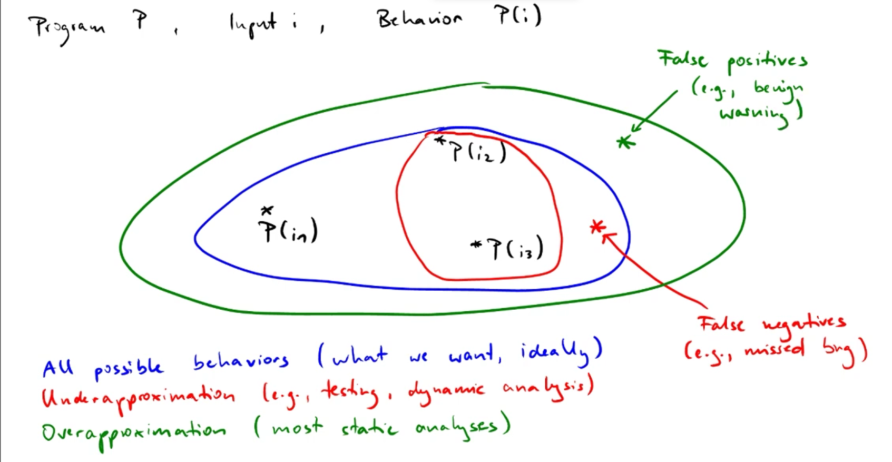

## Khởi tạo test

- Dynamic analysis cần input đầu vào để chạy chương trình => cần tạo test
- Test cần được tạo tự động để đảm bảo tính ngẫu nhiên
- Ví dụ:
  - Unit test: input là trình tự gọi các phương thức
  - UI test: input là trình tự các sự kiện UI
  - Fuzz test trình biên dịch: input là một chương trình

## Programing language

PL = syntax (form) + semantic (meaning) + implementation (execution)

### Implementation

- Compilation (biên dịch): 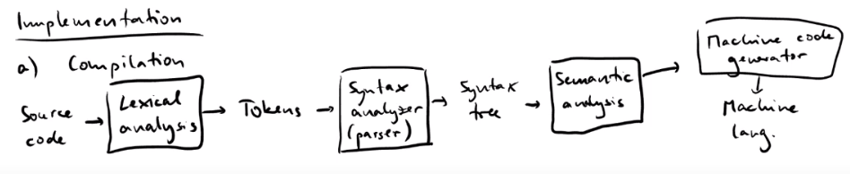
- Interpretation (diễn dịch)
- Hybrid (biên dịch + diễn dịch) -> Ví dụ: ngôn ngữ Java hay JavaScript

### Syntax

- Grammar (kiểm tra tính đúng đắn về mặt cú pháp của một chương trình) 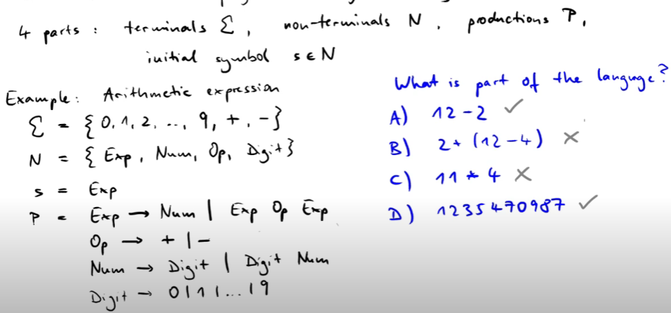

- Cây cú pháp: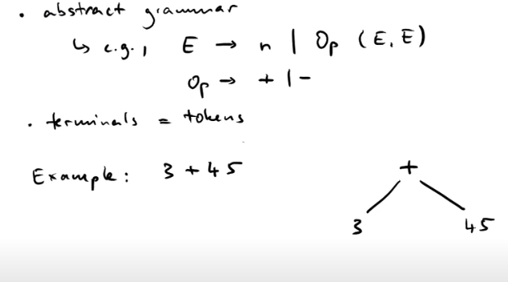

## Control flow graph

- Là một luồng điều khiển thôn qua chương trình
- G = (N, E), N: là tập hợp những blocks cơ bản (một dãy các hành động được thực thi cùng lúc), E: những khả năng có thể xảy ra tiếp theo
  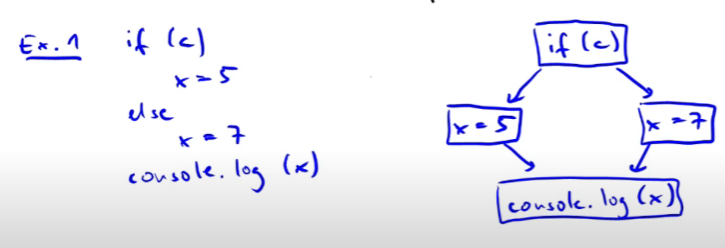
  (Các nodes bên trên là N, các nhánh bên trên là E)
  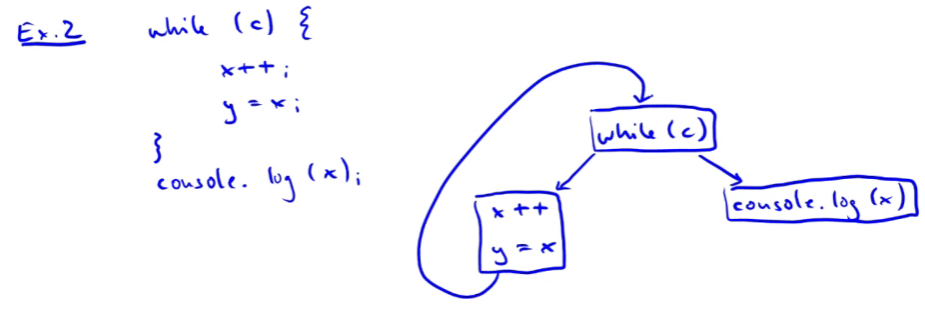

## Data dependence graph

- Mô hình luồng dữ liệu từ "definations" đến "uses" (dữ liệu được định nghĩa trước có thể sẽ được sử dụng cho về sau)
- G = (N, E), N: các hành động xảy ra, E: các mối quan hệ def-use có thể xảy ra, e = (n1, n2): n2 có thể sử dụng dữ liệu được định nghĩa ở n1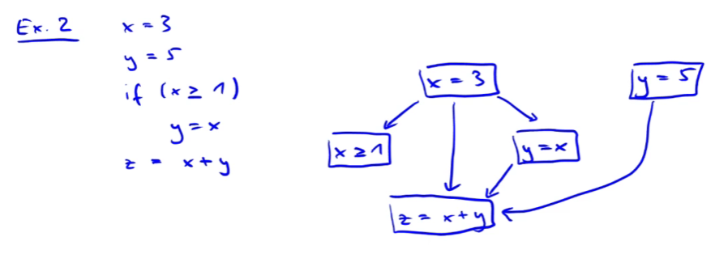

## Operational Semantics

- Ta cần phải xác định rõ ngữ nghĩa cho một chương trình để các hành vi trong một chương trình được định nghĩa một cách rõ ràng và nhất quán, nếu không xác định rõ ngữ nghĩa cho một chương trình thì chính trình biên dịch sẽ quyết định ngữ nghĩa cho nó (trình biên dịch khác nhau thì ngữ nghĩa cũng có thể khác nhau)

- Các loại semantics
  - Static Semantics, VD: type (kiểu dữ liệu trong một ngôn ngữ lập trình)
  - Dynamic Semantics:
    - Denotaional
    - Axiomatic
    - Operational (tập trung vào loại này)

$\to$ Hữu ích cho việc: thiết kế ngôn ngữ, triển khai ngôn ngữ, lập trình, và phân tích chương trình

1. Sơ bộ về Operational Semantics

- Transition System (Bắc cầu)
- Rule Induction (Luật quy nạp)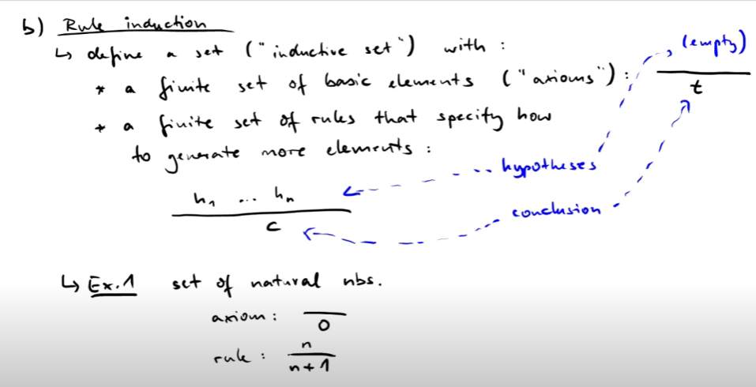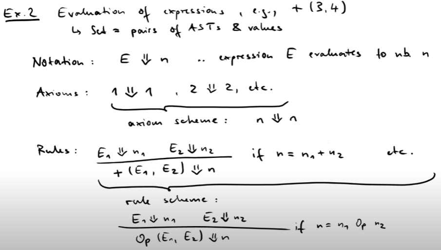
- Proof Tree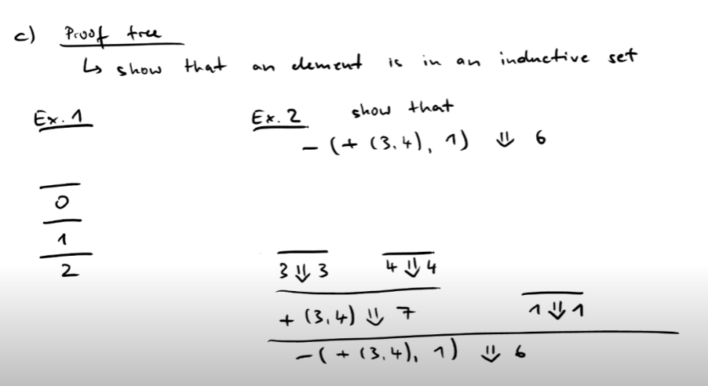

2. Cú pháp trừu tượng của SIMP (Simple imperative PL)

- Các câu lệnh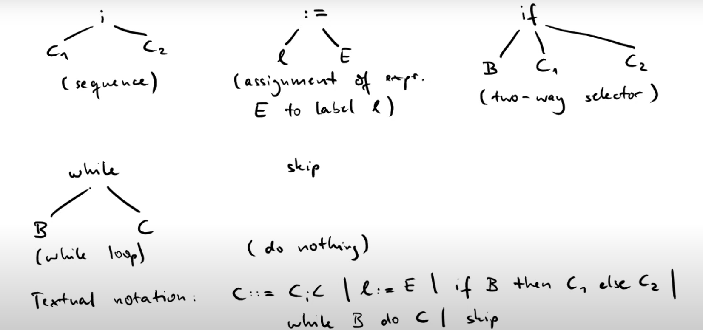
- Biểu thức số nguyên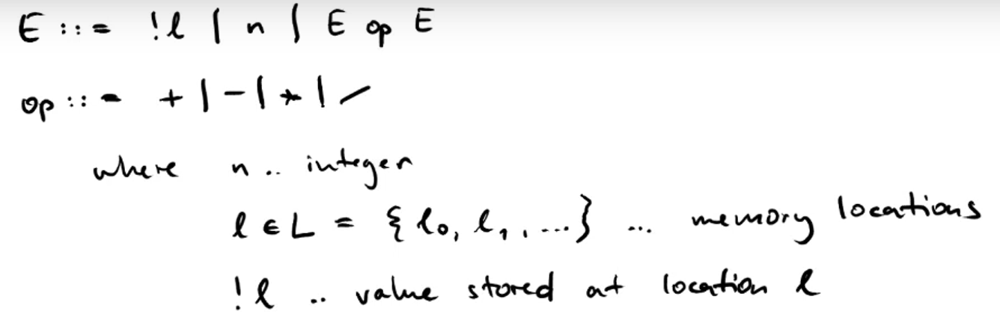
- Biểu thức boolean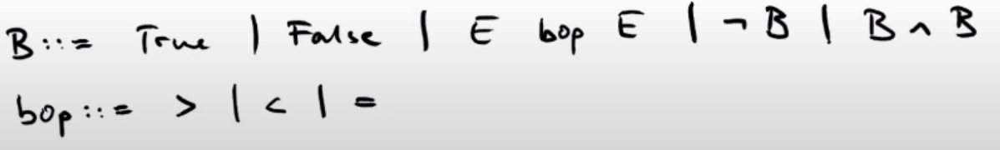bop: boolean operator
- Ví dụ: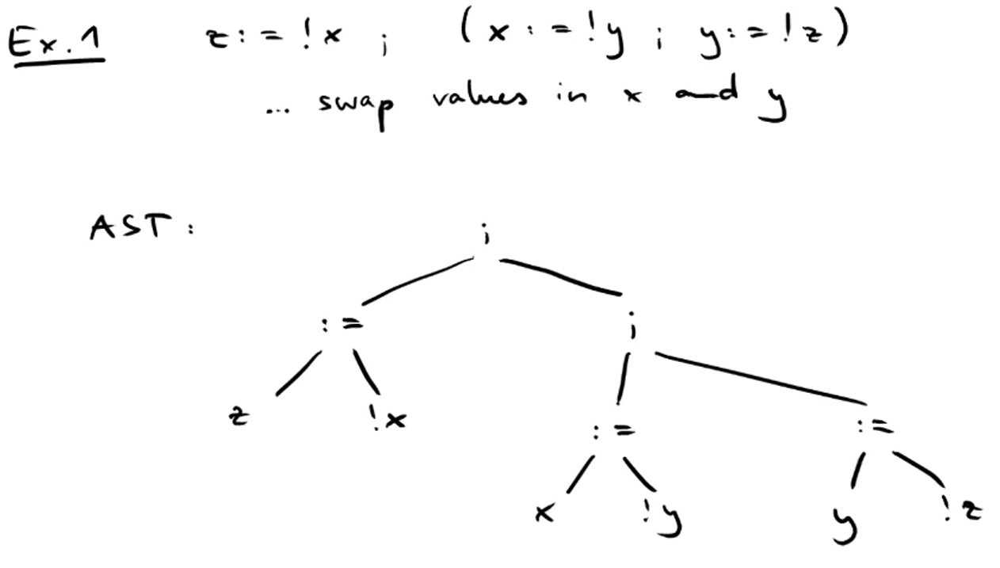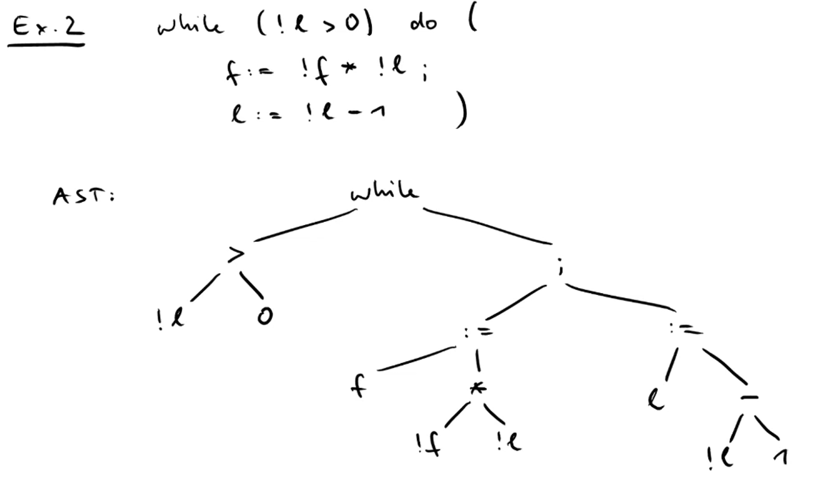

3. Abstract machine cho SIMP

- Có 4 thành phần chính

  - Control Stack (c) : lưu trữ những hướng dẫn để thực thi bất kì biểu thức nàof
  - Auxilary/result stack (r): lưu trữ những kết quả tức thời
  - processor: xử lý toàn bộ các phép toán và so sánh trong chương trình
  - memory/state (m): một phần chức năng ánh xạ vị trí đến giá trị.
    $m[l \to n]$ (cập nhật hàm m với ánh xạ mới từ $l$ tới n)
    $m[l \to n](l) = n$, $m[l \to n](l') = m(l')$

- Abstract machine (transition system) là một tập cấu hình <c,r,m>

- Mô hình thực thi của chương trình như là chuỗi các sự chuyển đổi từ trạng thái ban đầu (stack chưa rỗng) đến trạng thái đích (stack rỗng).
- Ký hiệu: <c,r,m> $\to$ <c',r',m'> (Transition rule)

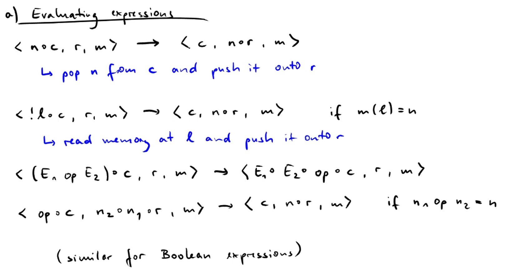 !$l$: đọc giá trị tại location $l$

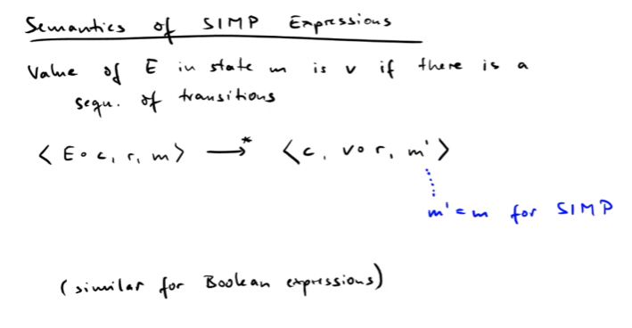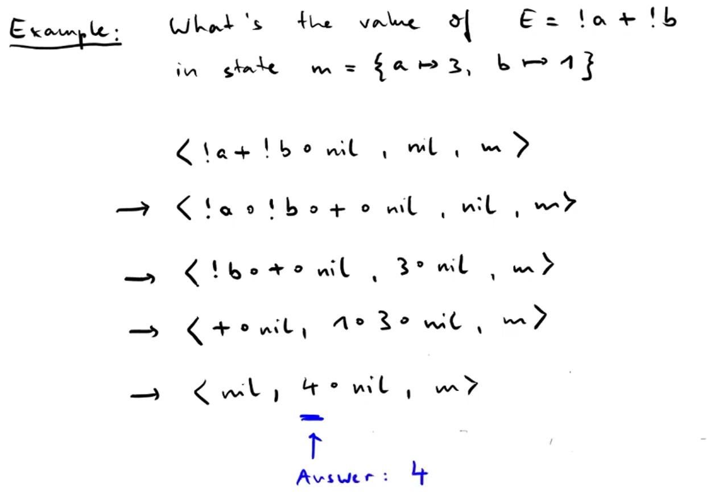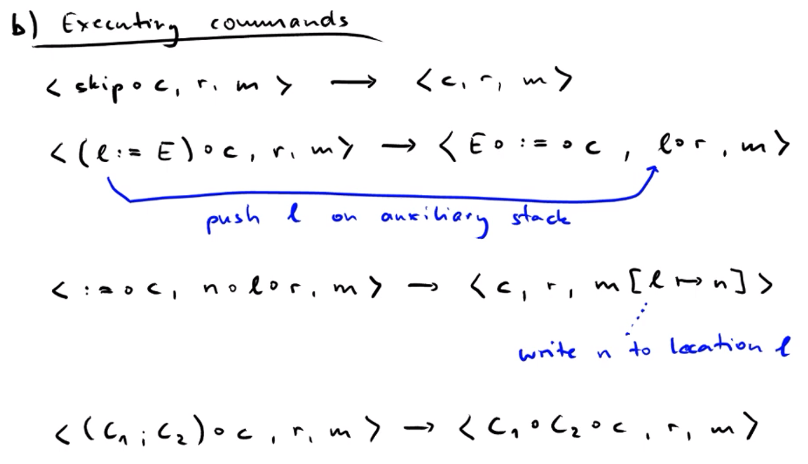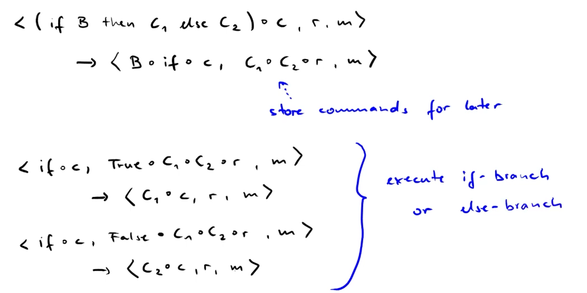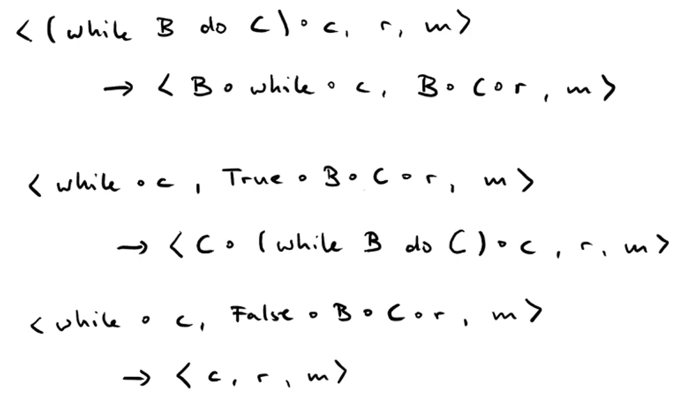

- Ngữ nghĩa của cách lệnh SIMP: chương trình C đang thực thi trạng thái m sẽ chấm dứt hoàn toàn và tạo ra trạng thái m' nếu như có tồn tại chuỗi các chuyển đổi trong chương trình
- Ví dụ: 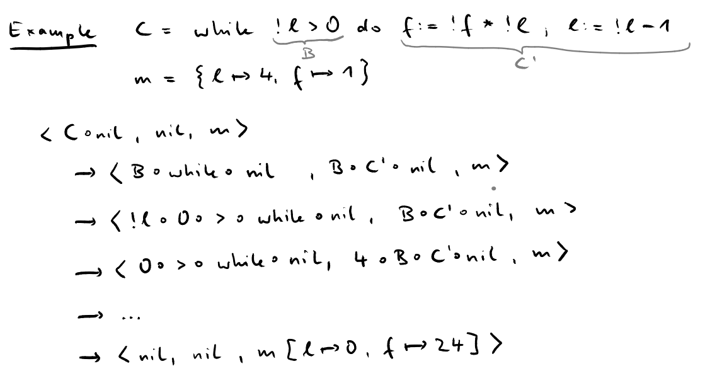
